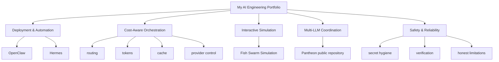

# Personal AI Agent Engineering Portfolio

This repository is my portfolio hub for showing how I deploy, build, evaluate, and control multi-model agent systems. It focuses on deployment, cost-aware orchestration, interactive prototyping, multi-LLM coordination, and safety/reliability practices.

This is not a monorepo that copies every independent project into one place. It combines public-ready documentation, navigation, and selected runnable work while linking out to independent repositories where appropriate.

## Featured Work

### 1. Pantheon — Telegram-native Multi-LLM Roundtable

**Status:** Runnable public project

Pantheon lets GPT, DeepSeek, Doubao, and Gemini participate in short roundtable discussions inside a Telegram group. The addressed bot speaks first, the conversation proceeds through bounded rounds, and the system produces a prompt-constrained neutral synthesis with token/cache statistics.

- [Independent source repository](https://github.com/yusongcao2004/pantheon-llm-roundtable)
- [Portfolio case study](projects/pantheon/README.md)

Pantheon is maintained as an independent public repository. Its full source code is not duplicated in this portfolio hub.

### 2. Personal Agent Deployment Stack — OpenClaw & Hermes Exploration

**Status:** Deployment and system-design documentation

OpenClaw and Hermes Agent are third-party tools. This repository documents my deployment, integration, configuration, routing, safety-boundary, and agent workflow thinking around those tools. It does not claim that I authored either framework.

Relevant documentation:

- [Deployment notes](DEPLOYMENT.md)
- [Safety notes](SAFETY_NOTES.md)
- [Lessons learned](LESSONS_LEARNED.md)

### 3. Cost-Aware Agent Orchestration

**Status:** Engineering capability demonstrated across the portfolio

Cost-aware orchestration is not presented here as a standalone software package. It is an engineering capability shown across Pantheon and the routing documentation:

- replacing unnecessary flagship-model calls with lower-cost models;
- combining models across multiple providers;
- tracking per-discussion token/cache statistics;
- using bounded rounds and concise prompting;
- handling provider-specific request compatibility;
- controlling thinking mode for cost-sensitive participation.

See [ROUTING_STRATEGY.md](ROUTING_STRATEGY.md) and the [Pantheon case study](projects/pantheon/README.md).

### 4. Fish Swarm Simulation — Codex-Assisted Interactive Prototype

**Status:** Runnable prototype

Fish Swarm Simulation is an embedded runnable project in this repository. It demonstrates AI-assisted iterative development, scope control, simulation performance work, and verification through tests, linting, and builds.

- [Project README](projects/fish-swarm-simulation/README.md)
- [3D screenshot](docs/screenshots/fish-swarm/fish-swarm-3d.jpg)
- [2D screenshot](docs/screenshots/fish-swarm/fish-swarm-2d.jpg)

### 5. Safety & Reliability Practices

**Status:** Cross-project engineering discipline

The portfolio emphasizes conservative engineering practices:

- `.env` secret isolation and source-control hygiene;
- human-in-the-loop review for consequential actions;
- conservative public claims about authorship and maturity;
- clear limitations of neutral synthesis;
- explicit acknowledgement that multi-model agreement is not factual verification;
- testing before public release.

See [SAFETY_NOTES.md](SAFETY_NOTES.md).

## Portfolio Overview

## Repository Map

- [DEPLOYMENT.md](DEPLOYMENT.md): Deployment assumptions, environment boundaries, and operational notes for a personal agent stack.
- [ROUTING_STRATEGY.md](ROUTING_STRATEGY.md): Model routing criteria, cost awareness, escalation, and fallback patterns.
- [SAFETY_NOTES.md](SAFETY_NOTES.md): Human oversight, permission boundaries, reliability practices, and failure modes.
- [LESSONS_LEARNED.md](LESSONS_LEARNED.md): Practical takeaways from documenting and reasoning about personal agent systems.
- [projects/fish-swarm-simulation/](projects/fish-swarm-simulation/README.md): Embedded runnable Codex-assisted simulation prototype.
- [projects/pantheon/README.md](projects/pantheon/README.md): Portfolio case study for Pantheon without duplicating its source code.
- [Pantheon public repository](https://github.com/yusongcao2004/pantheon-llm-roundtable): Independent source repository for the Telegram-native multi-LLM roundtable.

## Honest Limits

- This repository is not a unified deployable large-scale agent platform.
- OpenClaw and Hermes Agent are third-party projects; this portfolio documents my deployment, integration, configuration, and system-design practice around them.
- Pantheon source code lives in its independent public repository, not in this portfolio hub.
- Cost-aware orchestration is currently demonstrated as a cross-project engineering capability, not as an independently released package.
- Multi-model discussion is not factual verification.
- API calls can generate real provider costs.
- A neutral synthesis prompt is not a formal guarantee of unbiased output.

## Current Status

| Area | Status | Role in portfolio |
| --- | --- | --- |
| Pantheon | Runnable public project in independent repository | Multi-LLM Telegram coordination, concise discussion, synthesis, token/cache accounting |
| OpenClaw & Hermes exploration | Documentation and system design | Deployment, integration, routing, boundaries, workflow thinking around third-party tools |
| Cost-aware orchestration | Cross-project capability | Provider/model selection, bounded rounds, concise prompting, token-aware design |
| Fish Swarm Simulation | Embedded runnable prototype | Codex-assisted interactive engineering, performance, scope control, verification |
| Safety & reliability | Cross-project practice | Secret hygiene, review gates, honest limitations, release discipline |
